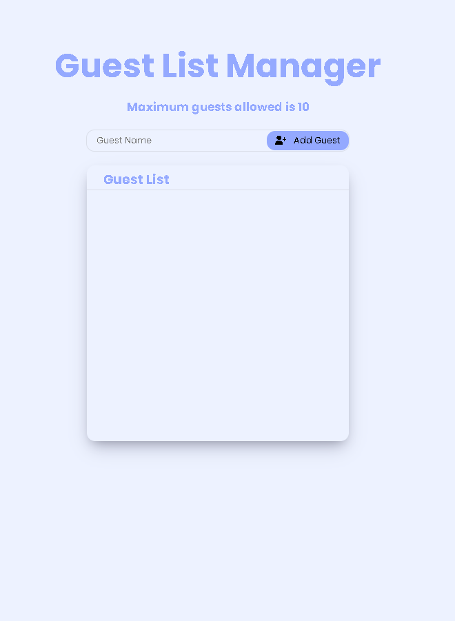

# GUEST LIST MANAGER
## Languages Used
     

This is a simple guest list manager allowing for the additionand removal of 
guests from a list, the list is limited to 10 perInvite: it will return an 
alert if the number of guests exceeds the maximum of 10.

